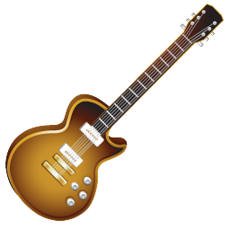

[![Contributors][contributors-shield]][contributors-url]
[![Forks][forks-shield]][forks-url]
[![Stargazers][stars-shield]][stars-url]
[![Issues][issues-shield]][issues-url]
[![LinkedIn][linkedin-shield]][linkedin-url]
 

  

<h3 align="center">Guitar Store</h3>

  

    A eCommerce music shop website built with Ruby on Rails, where users can buy and sell used instruments.
      
     
     
    ·
    <a href="https://github.com/joaogdfaero/guitar_store/issues">Report Bug</a>
    ·
    <a href="https://github.com/joaogdfaero/guitar_store/issues">Request Feature</a>
  

## Project Requirements :ballot_box_with_check:
● User registration and login;

● Users can list their instruments for sale.

● Users can purchase instruments that are listed for sale.

● Users can add instruments to their shopping cart.

● Users can manage the items in their shopping cart.

## Demonstration video 📺

https://github.com/joaogdfaero/guitar_store/assets/103076610/975b39a4-ff36-4116-921d-04e0517d2ddc

## How to use 

# 1 - Create your account.

# 2 - Onced logged in, click on "Sell (Vender)" to sell your item.

# 3 - Add the information, description and photo of your item.

# 3 - Click on any instrument to check it's description. Click on "Add to Chart (Adicionar ao Carrinho)" to buy the Item;

# 4 - Manage instruments in your shopping cart.

## Technologies
* Ruby 3.1.4
* Rails 7.0.4
* PostgreSQL 14.9

## Installation
1. **Clone this repository**  
` git clone https://github.com/joaogdfaero/guitar_store.git`

2. **Navigate to the project folder**  
` cd guitar_store `

3. **Install the necessary gems**  
` bundle install`

4. **Populate the database**  
` rails db:seed`

5. **Run the application server**  
` rails s `

6. **The server will start on port: 3000 - access:**    
` http://localhost:3000 `
##
 Author: <strong>João Gabriel Dal Forno (joao.dal@acad.ufsm.br)</strong>

(<a href="#readme-top">Back to Top</a>)

<!-- MARKDOWN LINKS & IMAGES -->
<!-- https://www.markdownguide.org/basic-syntax/#reference-style-links -->
[contributors-shield]: https://img.shields.io/github/contributors/joaogdfaero/guitar_store.svg?style=for-the-badge
[contributors-url]: https://github.com/joaogdfaero/guitar_store/graphs/contributors
[forks-shield]: https://img.shields.io/github/forks/joaogdfaero/guitar_store.svg?style=for-the-badge
[forks-url]: https://github.com/joaogdfaero/guitar_store/network/members
[stars-shield]: https://img.shields.io/github/stars/joaogdfaero/guitar_store.svg?style=for-the-badge
[stars-url]: https://github.com/joaogdfaero/guitar_store/stargazers
[issues-shield]: https://img.shields.io/github/issues/joaogdfaero/guitar_store.svg?style=for-the-badge
[issues-url]: https://github.com/joaogdfaero/guitar_store/issues
[license-shield]: https://img.shields.io/github/license/joaogdfaero/guitar_store.svg?style=for-the-badge
[license-url]: https://github.com/joaogdfaero/guitar_store/blob/master/LICENSE.txt
[linkedin-shield]: https://img.shields.io/badge/-LinkedIn-black.svg?style=for-the-badge&logo=linkedin&colorB=555
[linkedin-url]: https://www.linkedin.com/in/jo%C3%A3o-gabriel-dal-forno/
[product-screenshot]: images/screenshot.png
[Next.js]: https://img.shields.io/badge/next.js-000000?style=for-the-badge&logo=nextdotjs&logoColor=white
[Next-url]: https://nextjs.org/
[React.js]: https://img.shields.io/badge/React-20232A?style=for-the-badge&logo=react&logoColor=61DAFB
[React-url]: https://reactjs.org/
[Vue.js]: https://img.shields.io/badge/Vue.js-35495E?style=for-the-badge&logo=vuedotjs&logoColor=4FC08D
[Vue-url]: https://vuejs.org/
[Angular.io]: https://img.shields.io/badge/Angular-DD0031?style=for-the-badge&logo=angular&logoColor=white
[Angular-url]: https://angular.io/
[Svelte.dev]: https://img.shields.io/badge/Svelte-4A4A55?style=for-the-badge&logo=svelte&logoColor=FF3E00
[Svelte-url]: https://svelte.dev/
[Laravel.com]: https://img.shields.io/badge/Laravel-FF2D20?style=for-the-badge&logo=laravel&logoColor=white
[Laravel-url]: https://laravel.com
[Bootstrap.com]: https://img.shields.io/github/forks/joaogdfaero/guitar_store.svg?style=for-the-badge&logo=bootstrap&logoColor=white
[Bootstrap-url]: https://getbootstrap.com

